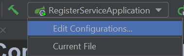
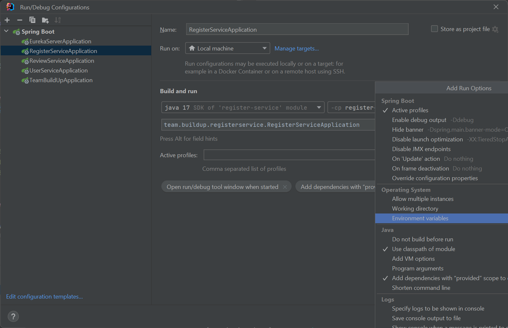
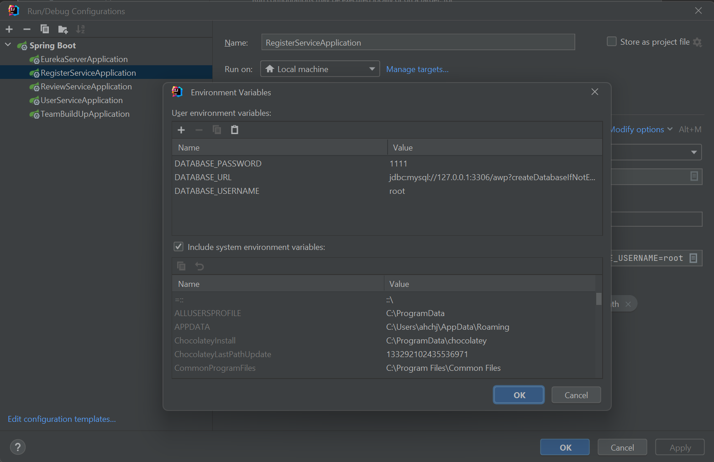

# AWP_BE
SpringBoot Project 

Please Read Carefully

# Role sharing

Please write the name of GitHub on the right.
```
System configuration: @MinhoJJang
register-service: 
review-service:
user-service:
PPT & (Presentation?): 
```

# Final Project Requirements
```text
Create a Drone or Bio-related web service in a Cloud-Native environment for each team.

Required (MSA):

- MSA & Rest Data
- Eureka
- ApiGateway
- Agaile (Collaboration between teams using Jira)

Optional (DevOps and CI/CD) :

Deploy (Docker, Jenkins, Kubernetes, Cloud etc.)
```

# Configuration Setting
Just follow the pom.xml of the modules
```text
jdk 17.0.6
SpringBoot 3.0.7
```

# Environment Setting
```
서비스가 3개밖에 없으므로 직접 대입해도 무방함
db이름은 awp

DATABASE_PASSWORD=1111;
DATABASE_URL=jdbc:mysql://127.0.0.1:3306/awp?createDatabaseIfNotExist\\=true&useUnicode\\=true&characterEncoding\\=UTF-8&characterSetResults\\=UTF-8&allowPublicKeyRetrieval\\=true&useSSL\\=false;
DATABASE_USERNAME=root
```
```yaml
  datasource:
    url: ${DATABASE_URL} # jdbc:mysql://127.0.0.1:3306/awp?createDatabaseIfNotExist=true&useUnicode=true&characterEncoding=UTF-8&characterSetResults=UTF-8&allowPublicKeyRetrieval=true&useSSL=false
    username: ${DATABASE_USERNAME} # root
    password: ${DATABASE_PASSWORD} # 1111
    driver-class-name: com.mysql.cj.jdbc.Driver
```
Follow the picture below, set for each service. 





# How To Work? 
```
Make your own branch. branch name should be like `***-service`
Then work it and test your code whether works good or not
PR when you're done
Do not merge directly!
```
